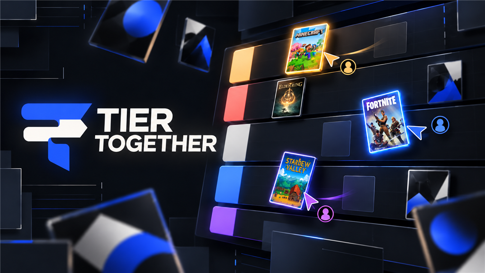

  

<h1 align="center">Tier Together</h1>

<strong>Settle the ranking without leaving the call.</strong>

Tier Together is a multiplayer Discord Activity for turning a familiar tier list into a conversation. A host chooses a built-in list or prepares a session-only one, everyone joins the same room automatically, and the group can rank together on a live board or vote privately before each result is revealed. The finished board includes a short recap and can be exported as a PNG. There are no Tier Together accounts, profiles, saved ballots, or permanent room histories; the experience is intentionally quick, shared, and temporary.

<a href="https://discord.com/oauth2/authorize?client_id=1556478676881776730&amp;scope=bot%20applications.commands&amp;permissions=0&amp;integration_type=0"><strong>Add Tier Together to Discord</strong></a>

The installation requests no bot permissions. After adding the app to a server, launch Tier Together from Discord’s Activity launcher in a voice channel.

## What is here

The current release includes three image-backed catalogues, editable tier labels and colors, temporary custom items, host controls, reconnect handling, keyboard and controller navigation, responsive layouts, two ranking modes, recap statistics, and a Discord-safe export path. The server is authoritative for room membership, host actions, moves, and votes. Active rooms live in memory and are scoped to the verified Discord application and Activity instance, so this version should run as one server replica. Restarting the process ends active rooms by design.

## Running the project

Use Node.js 20.19 or newer. Install the locked dependencies with `npm ci`, copy `.env.example` to `.env.local`, and fill the local file with your own Discord application settings. The example contains names and empty placeholders only; credentials must stay in the deployment platform or an ignored local file. Start development with `npm run dev`, run the domain tests with `npm test`, and use `npm run build` for production validation, TypeScript compilation, and the client-secret scan.

For a real Discord test, expose the local server through HTTPS and point the Activity URL Mapping at that address. A production deployment must serve HTTP and WebSocket upgrades from the same origin, keep the application at one replica, and provide an explicit allowlist containing its public hostname. Railway configuration is included in `railway.json`; the complete release walkthrough lives in [the deployment guide](docs/DEPLOYMENT.md).

## How it is put together

The persistent Activity shell is in `app/page.tsx`, the primary experience is in `app/home/embed.tsx`, and `app/ws/board/socket.ts` owns the synchronized room. Pure ranking, voting, and recap rules live in `lib/`, while the short-lived export handoff is split between `app/api/export/` and `server/export-store.ts`. This separation keeps Discord identity and authorization on the server without tying the domain rules to React. [Architecture](docs/ARCHITECTURE.md), [security policy](docs/SECURITY.md), [product notes](docs/PRODUCT.md), and [contributing notes](docs/CONTRIBUTING.md) explain the boundaries in more detail.

## Acknowledgement

Tier Together is built with [Ludicord](https://github.com/mrcholer/ludicord), the full-stack framework that handles the Discord Activity lifecycle, authentication, routing, and realtime transport. Our thanks to its maintainers for making this project practical to build and deploy.

## Project status

This repository is ready for a small production launch, but it is still an ephemeral single-process application rather than a durable service. Before a broad public release, complete the manual checks in the deployment guide inside Discord on desktop and mobile, confirm the legal URLs in the Developer Portal, and watch memory, reconnect, and export behavior during a real multi-user session.
